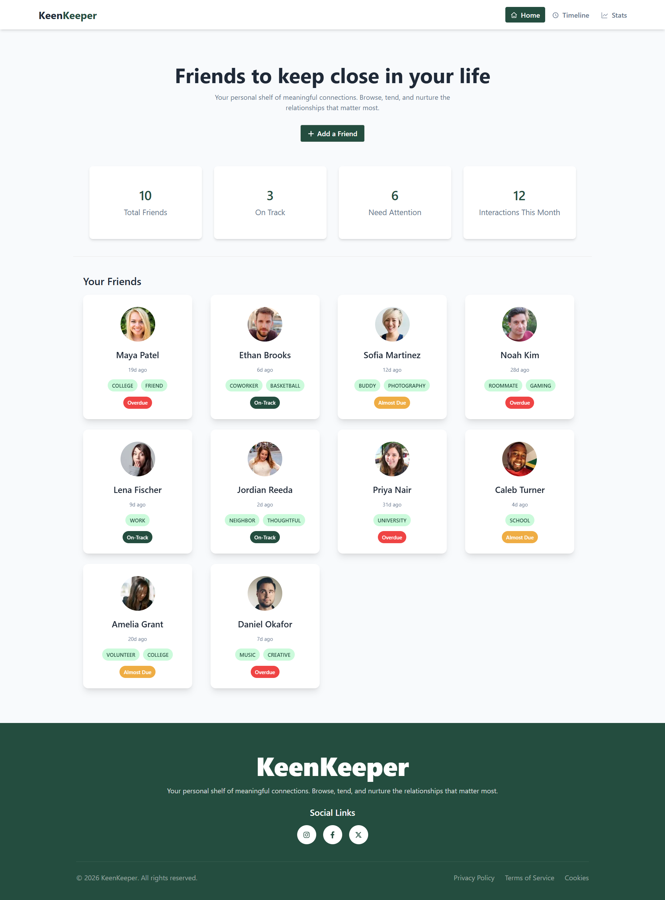
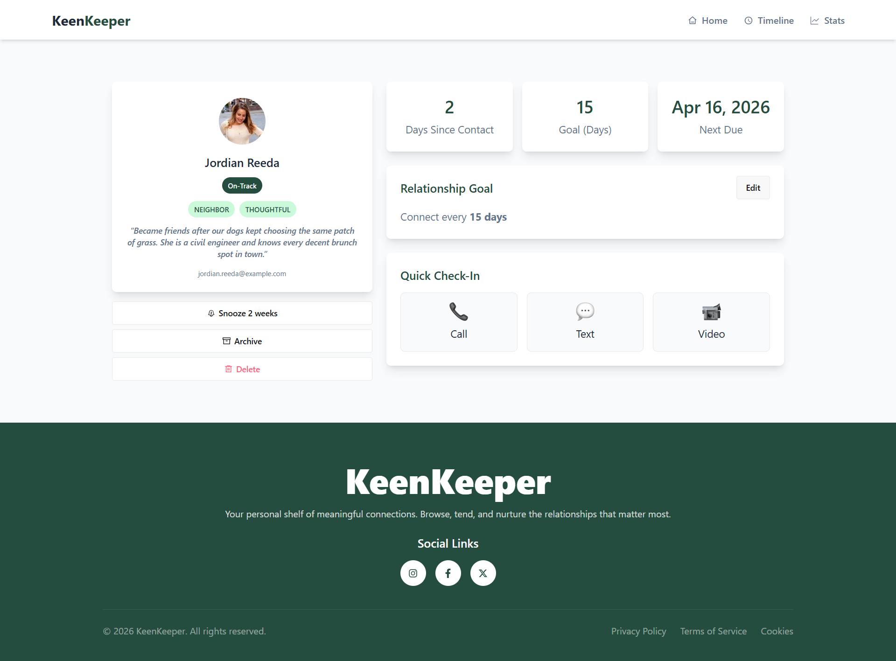
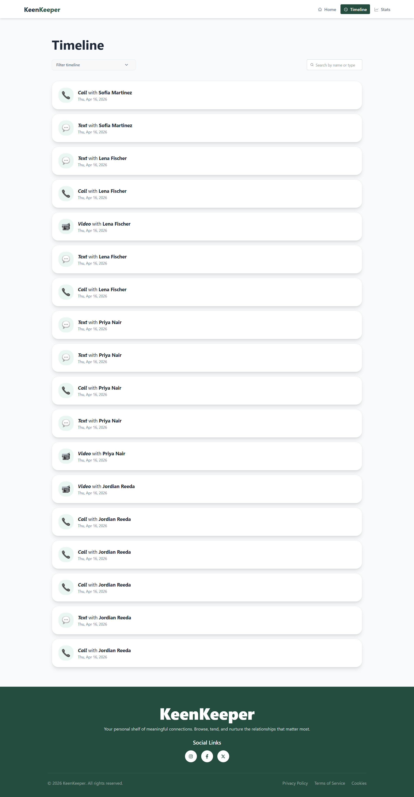
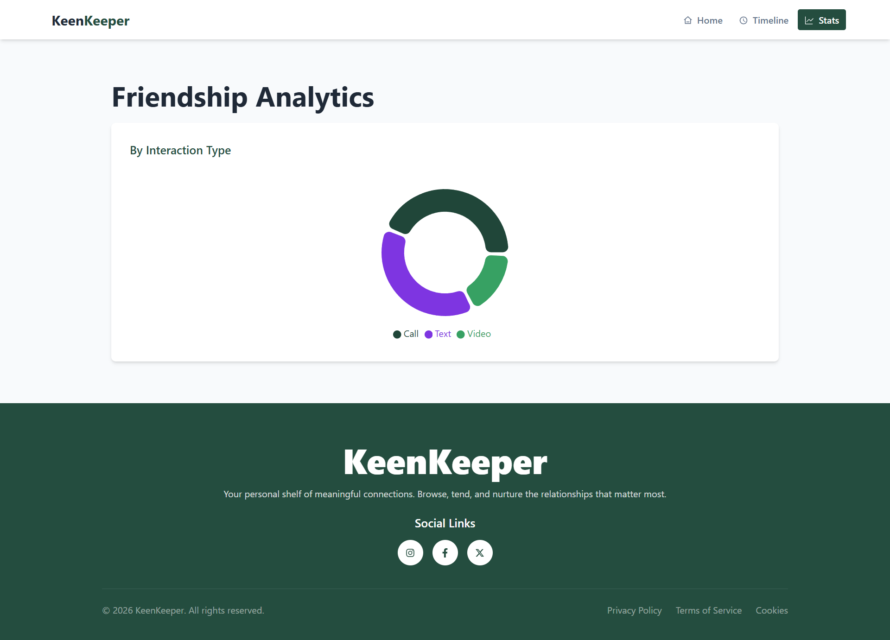

# KeenKeeper

KeenKeeper is a friendship and relationship tracking web app built to help users stay in touch with the people who matter most. It offers a clean, modern interface for browsing friends, viewing relationship goals, logging interactions, exploring timelines, and visualizing engagement stats.

### Live Website + Repository
[Visit KeenKeeper](https://keenkeeper-mi-araf.vercel.app/) &nbsp; +&nbsp; [GitHub Repository](https://github.com/mi-araf/b13-a7-keenkeeper-page)

## Project Overview
A responsive friendship tracking web app to manage connections, search interaction timelines, and visualize relationship activity.

## Technologies Used

- **Next.js**
- **React.js**
- **Tailwind CSS**
- **DaisyUI**
- **React Icons**
- **React Toastify**
- **Recharts**

## Key Features

### 1. Friend Directory with Detail Pages
Users can browse a collection of friend cards and open dynamic friend detail pages to view profile information such as contact status, tags, email, bio, relationship goal, and next due date.

### 2. Timeline with Filter + Search
The Timeline page allows users to:
- filter interactions by type such as **Call**, **Text**, and **Video**
- search timeline entries by **friend name** or **interaction type**
- quickly find specific communication history in a clean and simple UI

### 3. Friendship Analytics Dashboard
A dedicated Stats page visualizes interaction activity using charts, making it easier to understand communication patterns at a glance.

### 4. Clean and Responsive UI
The project is fully responsive and designed with a minimal, aesthetic interface using DaisyUI and Tailwind CSS for a smooth experience across desktop and mobile devices.

## Pages Included

- **Home Page**
- **Friend Details Page**
- **Timeline Page**
- **Stats Page**
- **Custom Not Found Page**


## Author

Developed by **Araf**

If you like this project, feel free to star the repository.

---

### Preview
##### Home Page


##### Friend Detail Page


##### Timeline Page


##### Stats Page



## Local Setup

Clone the project and run it locally:

```bash
git clone https://github.com/mi-araf/b13-a7-keenkeeper-page.git
cd b13-a7-keenkeeper-page
npm install
npm run dev
````

Then open:

```bash
http://localhost:3000
```

---